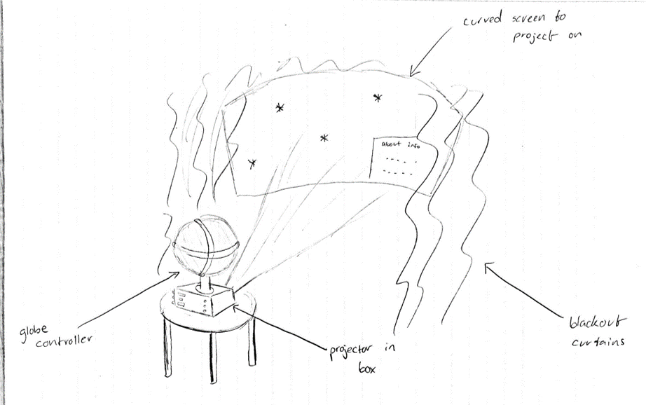

# Checkpoint 1 Demo

Here's a sketch of how the completed product will look:

This is a workflow diagram of how the software pieces will interact with each other.

We have deviated slightly from the original sketch because we have decided to have a slider on the interface so someone can "scrub" through time (intent is to make this a more tactile experience). The interface will only be used for selecting time and location, and the software will determine the lighting, sound, and fog based on the pollution at the selected location.

Additionally, for Location Determination, we said that we would have some code to take an input angle and map it to the longitude. After further research, most of the processing for the incoming data from the encoder can't actually be done without the encoder. Some skeleton code has been added in `GlobeRead/GlobeRead.ino`.

Items we would like feedback on are detailed in issue #8