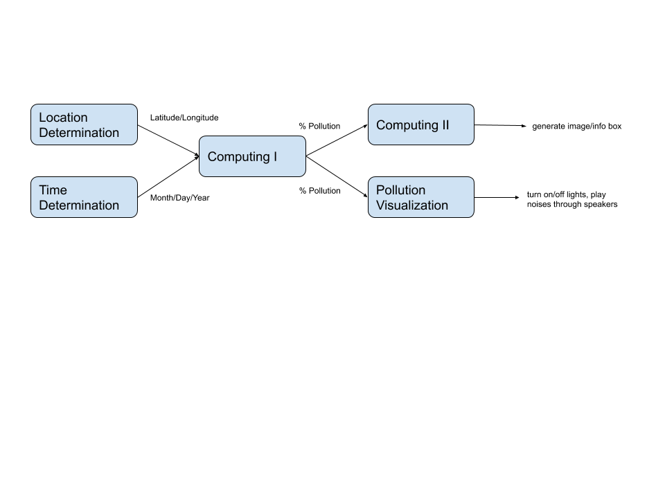

# Project Plan
Created according to [this description.](https://github.com/gwu-iot/collaboration/blob/master/project_criteria.md#timeline)

## Components of Project
1. Location Determination: add sensing capabilities to a physical globe and writing software to use these sensors to determine the latitude and longitude of the location that is currently facing upward on the globe. Latitude and longitude are sent to Computing I.
2. Time Determination: construct a physical interface with dials and disks which can be used to select a time, as well as "scrub" forward and backward from the selected time. This component is also responsible for writing software to provide time (with a low latency) to Computing I.
3. Computing I: in charge of the "internet" aspect. This role is in charge of using existing APIs or writing new APIs to gather information about the viewable night sky, air pollution, noise pollution, global temperature, and constellations based on the input coordinates and time.
4. Computing II: in charge of creating the image to be projected on the screen. Will use the star positions and light pollution data produced Computing I to create an image of the night sky over the selected location, lightened or darkened depending on light pollution data gathered from the Internet. This image will need to be digitally formatted to match the shape of the projection surface before sending this image to the projector. This computation should be done efficiently so it can be projected with a high refresh rate.
5. Pollution Visualization: this component will be in charge of actuation. Using data on pollution gathered by Computing I, fog will be produced to represent air pollution. Warm lights will be projected on the globe to represent heat pollution. City sounds will be played through speakers to represent noise pollution.
6. Construction: building the projection surface and curtain frame to create a controlled environment for the user so that the experience is as immersive as possible.

## Timeline
Each number corresponds to a component of the project listed above. For example 1) refers to tasks for Location Determination.

**Checkpoint 1**
1. Have software written to map an input angle (probably via terminal) to a longitude, based on an intial longitude value
2. Have a definite schematic of how the clock interface will be built/function
3. Make a list of all existing APIs for the project and determine what needs to be written from scratch
4. Determine an API to get constellations online, and what kind of digital manipulation can be done to an image to create realistic brightening effects based on light pollution
5. Have a definite schematic of how all the actuators will connect to the main controller

**Checkpoint 2**
1. Have the globe done
2. Have the clock done
3. Have data moving from Computing I to Pollution Visualization and creating some actuation (only one type of pollution is not accounted for yet)
4. Projector works but image is not necessarily warped to match the projection surface
5. See 3)

## Interfaces

## Security
- Incorporate security at design phase - we are doing this by definition because we are considering these security issues at this early stage of the project, rather than trying to incoporate security into a machine that is already built
- Security updates - the device's Internet capabilities can be disabled for repair without necessarily breaking the entire display (night sky maps can be downloaded for future reference but the display may not have all pollution data). Since this device needs to be in its controlled exhibition environment, this principle is not as big a concern -- we can physically discourage people from tampering with the disabled device if a security patch needs to be applied
- Build on proven practices - **this does not apply** because our device can be physically operated on by its creators if it experiences a service disruption, by virtue of being more an art exhibition than a deployed service device
- Prioritize measures according to potential impact - **this doesn't really apply**, again, because this device will not be deployed in an environment when its creators are not physically nearby to solve issues. Our priority will be to ensure that upkeep of the device occurs when people are not inside the display (to keep the experience as immersive as possible). If a service outage occurs when someone is viewing the exhibit, there is no danger or risk of personal harm. Thus, the measures are simply to leave the exhibit while we fix it.
- Promote transparency - this project is open source with materials purchased on websites like Amazon. In theory, anyone could construct one of these. Vulnerability reports can be posted to this repository to alert anyone who is following the project of any changes.
- Connect carefully and deliberately - **this does not apply** because, for our exhibit to have full impact, it needs to be connected to the Internet for as long as it is on. However, this isn't risky because as soon as the exhibit is no longer being displayed, it can be fully shut down, thereby preventing hackers from using it as part of a DDoS attack if they somehow managed to gain access while the device was operating.

## Component Assignment
1. Rick
2. Becky
3. Lily
4. Rachell
5. Tuhina
6. We will all meet up for a couple hours very soon after Checkpoint II to knock this out

## Hardware List
[Here's the spreadsheet of parts we'd like to order eventually](https://docs.google.com/spreadsheets/d/1sid9kRepjA9d2olELjUwhC4QWxLPoXIVlw6AmRF54p0/edit#gid=0)
