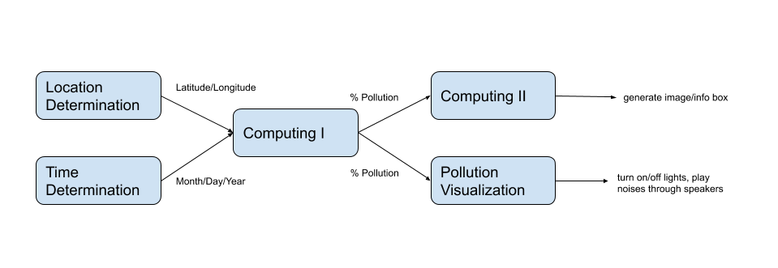

# Project Plan
Created according to [this description.](https://github.com/gwu-iot/collaboration/blob/master/project_criteria.md#timeline)

## Components of Project
1. Location Determination: add sensing capabilities to a physical globe and writing software to use these sensors to determine the latitude and longitude of the location that is currently facing upward on the globe. Latitude and longitude are sent to Computing I.
2. Time Determination: construct a physical interface with dials and disks which can be used to select a time, as well as "scrub" forward and backward from the selected time. This component is also responsible for writing software to provide time (with a low latency) to Computing I.
3. Computing I: in charge of the "internet" aspect. This role is in charge of using existing APIs or writing new APIs to gather information about the viewable night sky, air pollution, noise pollution, global temperature, and constellations based on the input coordinates and time.
4. Computing II: in charge of creating the image to be projected on the screen. Will use the star positions and light pollution data produced Computing I to create an image of the night sky over the selected location, lightened or darkened depending on light pollution data gathered from the Internet. This image will need to be digitally formatted to match the shape of the projection surface before sending this image to the projector. This computation should be done efficiently so it can be projected with a high refresh rate.
5. Pollution Visualization: this component will be in charge of actuation. Using data on pollution gathered by Computing I, fog will be produced to represent air pollution. Warm lights will be projected on the globe to represent heat pollution. City sounds will be played through speakers to represent noise pollution.

## Timeline
What specifically will be done by both checkpoints
apis and documentation
definite schematic of how to integrate all the actuators together
have a plan on how to make the flip clock interface
what api will be used for constellations, and what digital manipulation can be done on an image to brighten or dim it

## Interfaces

## Security
How will security be considered? What specifically are we ignoring? This references a paper we haven't read yet reeeeeeeeee

## Component Assignment
Who's doing what
